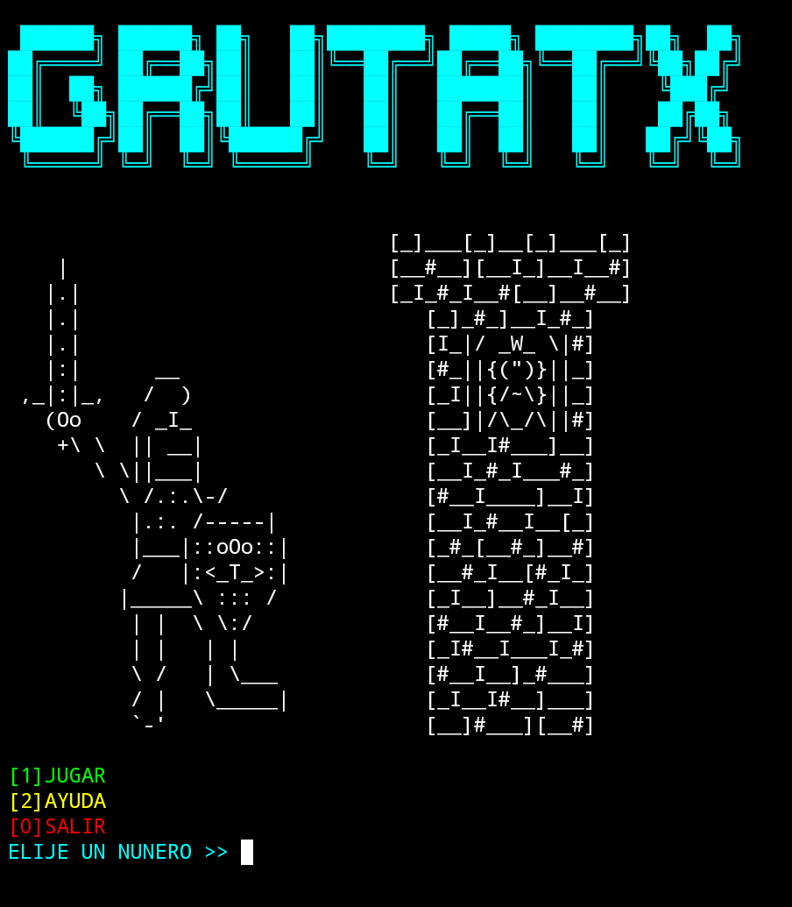
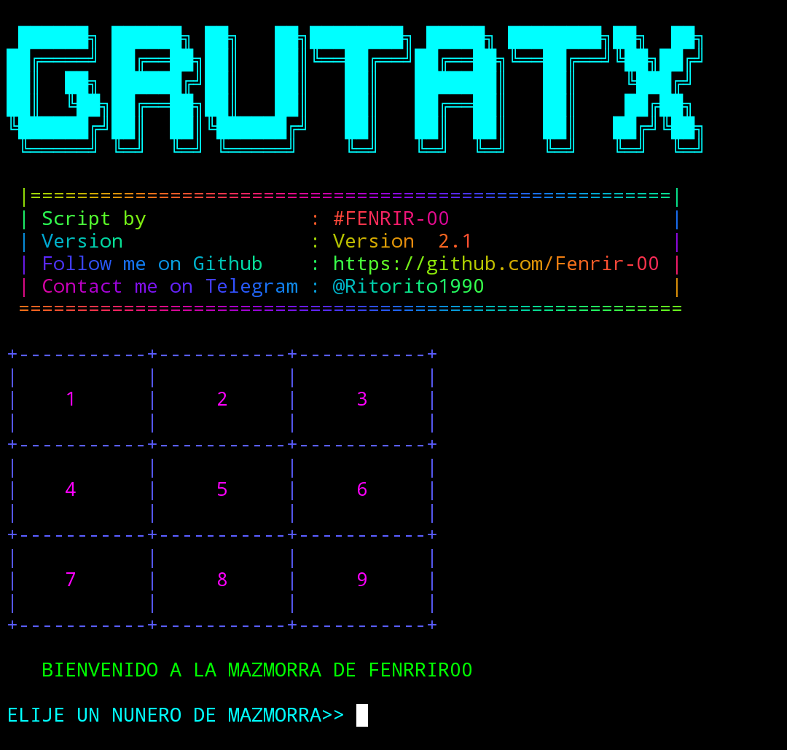
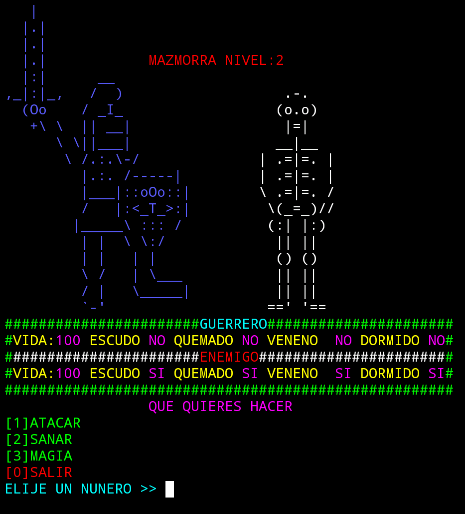

# instalación
``` bash
pkg install git
```
```bash
pkg install python
```
```bash
git clone https://github.com/Fenrir-00/mazmorratx
```
```bash
cd mazmorratx
```
```bash
python3 mazmorra.py
```


